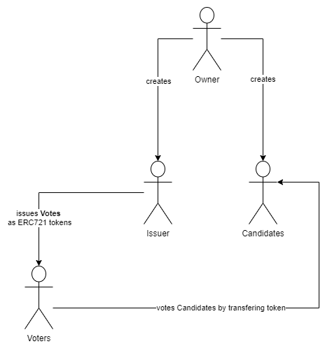

# Decentralized Voting System
This project presents an idea for a decentralized voting system made in React and using the Ethereum blockchain 
as the backbone to store information regarding the voting process.
The vote is represented as an **ERC721** token which is transferred to a candidate and consumed.
The system itself consists of four user roles:
- **Issuers** (issues votes)
- **Candidates**
- **A Contract Owner** (creates candidates and issuers)
- **Voters** (transfer votes to candidates)
 
The candidate itself cannot reuse the votes transferred to him and at the end of the voting process the candidate with the most tokens wins.
#### Voting Process Diagram

# Advantages of using a Blockchain for a voting system
- The voting process is transparent and clearly defined
- The double-spending of votes is not possible

# Disadvantages of using a Blockchain for a voting system
- Voter anonymity is compromised even though we use only a public address
- Each voting action costs ether

# Possible Improvements
- Holding Candidate data (E.g: CV, Candidate Vision Plan) on IPFS
- Mixing transactions or other procedures to offer voters better anonymity
- Multiple other improvements...

